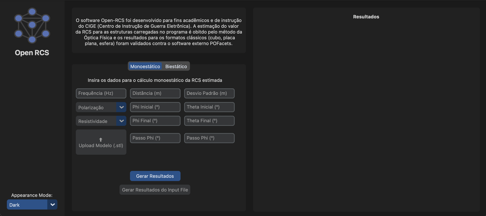
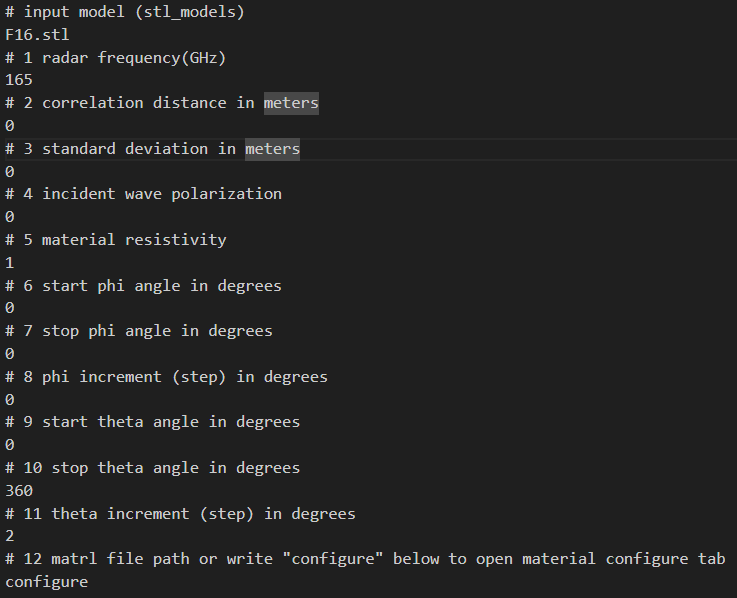
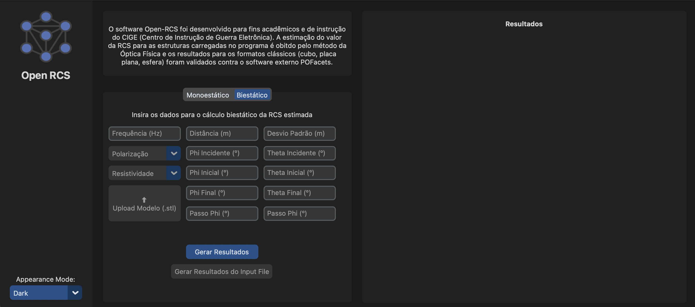
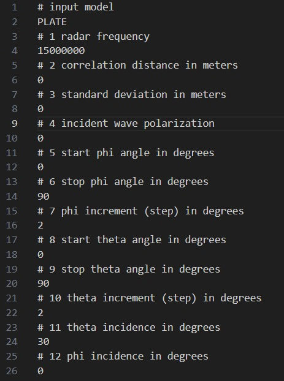

# Open RCS: an open-source platform for calculating Radar Cross Section from 3D targets

The software Open RCS is inspired by POFACETS with an open source plataform and is being developed incrementally, validating the outputs generated from the same inputs, but with different types of CAD models, from the simplest to the most complex. The software will use both Physical Optics (PO) and Geometrical Optics (GO) techniques for RCS measurement and it will be divided into monostatic and bistatic modules.

## In this README:

- [Theoretical Foundation](#theoretical-foundation)
- [Software Information](#software-information)
- [Usage](#usage)

  - [Initial setup](#initial-setup)
  - [Monostatic Simulation](#monostatic-simulation)
  - [Bistatic Simulation](#bistatic-simulation)

- [FAQ](#faq)
- [Author Info](#author-info)
- [References](#references)

## Theoretical Foundation

Radar cross section (RCS) is a measure that shows how much a radar can detect an object. If this measurement is large, it is more easily detectable by radar. Many factors can affect this measurement, such as: the size of the target related to the wavelength, the kind of material that covers the target, the frequency of the radar, the angle of incidence, the geometry of the target, among others.

Since the invention of radar in World War II, its use has been a crucial factor in the success or failure of military campaigns. Concurrent with the development of radar detection capabilities, techniques to reduce the electromagnetic signature or RCS of important military platforms, such as aircraft, vessels, and armored vehicles, has proven to be an essential line of investment to ensure the success of such operations.

Despite the fundamentals related to RCS being mastered since the time of the development of the first radar, defining the electromagnetic signature of a target is still a highly complex task. Analytical calculation is only possible for simple geometry targets. For real objects, we can only determine the RCS through experimental measurement or through computational numerical simulation; each method has its advantages and disadvantages. One of the great advantages of the computational simulation of the RCS is that the real target is not always available, or it is still in the design phase. When the objective is to reduce the RCS, it is practically unfeasible to make several changes in the target geometry or RAM application with many different configurations, that is why RCS simulation is a valued technique for studying military projects.

## Software Information

The present version of Open RCS consists of the implementation of the monostatic module, whose code will serve as the basis for implementing the bistatic module after refactoring and modularization of the initial version. The method used in the simulation is an approximation by physical optics (PO). The reflection on each facet is processed as an isolated surface without including multiple reflections or edge diffractions. Each facet is considered entirely hidden or fully illuminated by the incident wave, which determines whether or not this will be computed in calculating the final object's RCS. Furthermore, the polarization TM-z ou TE-z was represented through complex types in Python 3.

The calculation of the intensity captured by the reflection occurs through a Taylor series, whose parameters of the region and number of terms were chosen arbitrarily. These parameters have external optimization references in relation to accuracy and computational time for calculating the RCS using this approximation. Using this method, it is possible to generate the intensity and electromagnetic power results for each direction.

The reflection directions are defined using simple spherical coordinates from the input range and sampling of phi and theta. If only a value of phi is specified for an interval of theta, a projection graph will be plotted in a theta-cut, and vice versa. In the case where phi and theta are both non-unitary, i.e., defined on an interval, a two-dimensional contour of the directing cosine.

## Usage

### Initial setup

1. Clone the repository.

   _You can do it by running:_

   ```
   git clone https://github.com/comp-ime-eb-br/open-rcs
   ```

2. Install Python 3.11.1+ and libraries

   _If you are using pip you can do it by running:_

   ```
   pip install python3
   pip install -r requirements.txt
   ```

3. In order to start the application run the main.py file

   ```
   python main.py
   ```

### Monostatic Simulation

1. Input the simulation parameters.

2. Select the STL file

3. Press the generate results ("Gerar Resultados") button.

  

Alternatively, you can run the RCS simulation with the .dat file and press the generate results from input file ("Gerar Resultados do Input File") button.

The input parameters should be added to the input_files/input_data_file_monostatic.dat file, in the following model:

  

### Bistatic Simulation

1. Input the simulation parameters.

2. Select the STL file

3. Press the generate results ("Gerar Resultados") button.

  

Alternatively, you can run the RCS simulation with the .dat file and press the generate results from input file ("Gerar Resultados do Input File") button.

The input parameters should be added to the input_files/input_data_file_bistatic.dat file, in the following model:

  

## FAQ

#### Should I use this software as a trusted RCS prediction?

The software was only validated for BOX and PLATE models. The comparison between the RCS values generated by the Open RCS software and the academic valeus found in the references for each incidence angle resulted in an average error of approximately E-12, which was considered a negligible error value for the analysis.

## Author Info

The software was developed in a Computer and Communications Engineer graduation project as requirement to acquiring a bachelor degree in these areas. The graduating students and advisors involved are mentioned bellow, with their following contact info:

- Amanda Assis Lavinsky (amanda.lavinsky@ime.eb.br)
- 1º Ten Lucas Machado Couto Bezerra (lucas.bezerra@ime.eb.br)
- 1º Ten Mayara Ribeiro Mendonça (mayara.mendonca@ime.eb.br)
- 1º Ten Yu Yi Wang Xia (yu.xia@ime.eb.br)
- Maj Gabriela Moutinho de Souza Dias (gabriela@ime.eb.br)
- Maj Claudio Augusto Barreto Saunders Filho (saunders@ime.eb.br)
- Cel Clayton Escouper das Chagas (escouper@ime.eb.br)

## References

1. Open Source Initiative (n.d.). Open Source Initiative. https://opensource.org/
2. Battery Open Source Software Index (n.d.). Battery Open Source Software Index (BOSS). https://www.battery.com/blog/boss-index-tracking-explosive-growth-ope
   n-source-software/
3. Guo, P.: Python is now the most popular introductory teaching language at top U.S. Universities. https://cacm.acm.org/blogs/blog-cacm/176450-python-is-now
   -the-most-popular-introductory-teaching-language-at-top-us-universities/fulltext (2014)
4. McCann, J.: The meteoric rise of open source and why investors should care. Forbes. https://www.forbes.com/sites/forbestechcouncil/2017/09/22/the-meteoric-rise-of-open-source-and-why-investors-should-care (2017)
5. Knott, E. F., Shaeffer, J.F., Tuley, M.T.: Radar Cross Section. Artech House (1993)
6. Ruck, G.: Radar Cross Section Handbook: Volume 1. Springer US. (1970)
7. Sumithra, P., Thiripurasundari, D. (2017). A review on Computational Electro-magnetics Methods. Advanced Electromagnetics, Vol. 6, No. 1, March 2017.
8. Jenn, D.: Radar and laser cross section engineering. American Institute of Aeronau-tics and Astronautics, Inc. (2005)
9. Swords, S. S.: Technical History of the Beginnings of Radar. Institute of Electrical Engineers (1986)
10. Chatzigeorgiadis, F., Jenn, D.C.: A MATLAB physical-optics RCS prediction code. IEEE Antennas and Propagation Magazine (2004)
